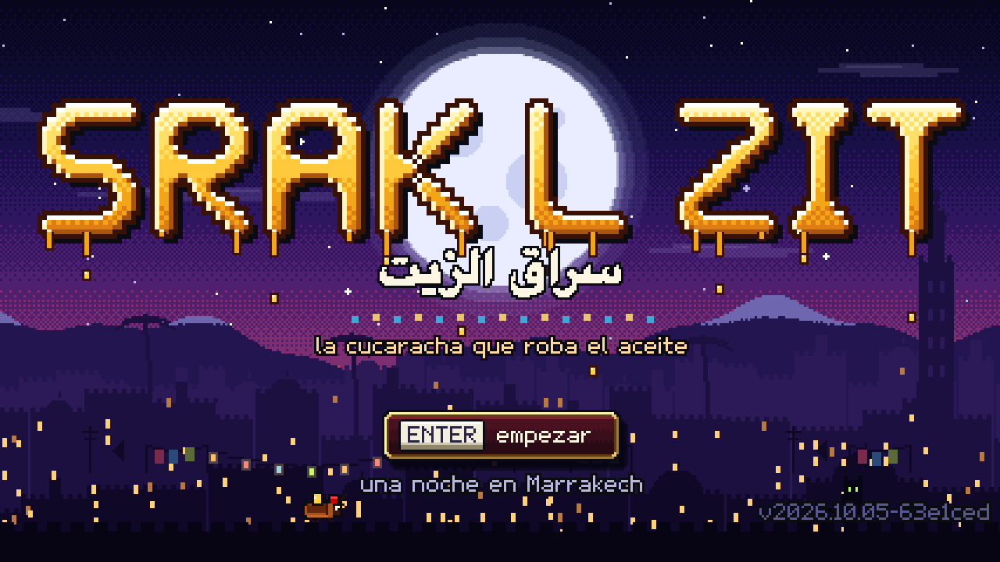

<div align="center">



# 🪳 SRAK L ZIT · سراق الزيت

**En dariya, a la cucaracha se la llama «ladrona de aceite». Este juego se lo toma al pie de la letra.**

[](https://gavilanbe.github.io/srak-l-zit-2/)


</div>

---

## Qué es

Un juego de sigilo en el que una cucaracha marroquí, con su tarbouch y sus dos crías hambrientas, roba el zit de toda la casa noche a noche. Es 3D de verdad dibujado a baja resolución, con contornos y sombreado por bandas, para que parezca pixel art.

Es un juego distinto de [Srak l-Zit · El Atraco del Aceite](https://github.com/gavilanbe/srak-l-zit): misma cucaracha de fondo, otro juego entero.

## La casa

| Capítulo | Sitio | Quién vigila |
|---|---|---|
| 1 | La cocina | La jadda y su belgha |
| 2 | El salón | Jeddi, que duerme delante de la tele y lo oye todo |
| 3 | El patio | Las gallinas, y Mchicha el gato en la oscuridad |
| 4 | El hanout | Si Brahim, que nunca cierra, y sus cepos |

Dos noches por sitio. Después del hanout llega el final, y la casa se repite más difícil.

## Cómo se juega

| | Teclado | Móvil |
|---|---|---|
| Moverse | WASD o flechas | Palanca (la bandeja de latón) |
| Correr (hace ruido) | Shift | Palanca a fondo |
| Saltar; en el aire, volar | Espacio | El tarbouch |
| Soltar una gota | E | La gota |
| Pausa | P | Botón de pausa |

- Carga hasta tres gotas y llévalas a tu agujero antes de que amanezca.
- Bajo los muebles no te ven. Encima de ellos hay aceiteras rápidas, pero estás a la vista.
- Volar gasta un ala; se recupera entregando tres gotas de una vez.
- Una gota soltada en el suelo es un charco: quien lo pise, resbala.

## Por dentro

- **Sin build**: módulos ES y Three.js copiado en `play/vendor`. Todo lo demás (modelos, texturas, ilustraciones, fuente de píxeles e interfaz) se dibuja por código; no hay ni una imagen de arte.
- **Música**: una orquesta árabe sintetizada con WebAudio toca un único tema propio, que cada sitio oye en su maqam y con sus instrumentos, con capas según el peligro.
- **Aplicación instalable**: funciona sin conexión, guarda la partida y avisa cuando hay versión nueva.

```
play/            lo que se publica
  src/           el juego
  vendor/        Three.js
tools/
  serve.py       servidor local (también para el móvil por la wifi)
  pwa.mjs        versión, service worker, iconos y pantallas de arranque
  pwa-test.mjs   comprueba instalación, uso sin conexión y actualización
  shot.mjs       capturas en un navegador sin ventana
```

## En local

```sh
python3 tools/serve.py   # http://localhost:8766
```

## Créditos

Hecho con Claude Opus 5.5.
